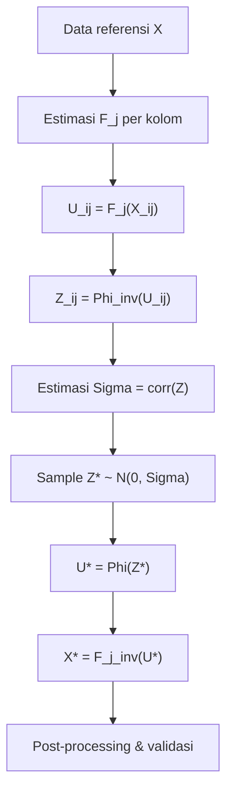

# Metode Sintesis Data: Gaussian Copula

Dokumen ini menjelaskan bagaimana **Copula-Based Synthesis** dengan **Gaussian Copula** bekerja, mengapa metode ini dipilih untuk data sintesis praktikum, dan langkah-langkah algoritmiknya.

---

## 1. Masalah yang ingin diselesaikan

Data praktikum multivariat — misalnya catatan aktivitas yang melibatkan nominal, frekuensi, lokasi, dan saluran — memiliki **distribusi marginal berbeda-beda** sekaligus **korelasi antarvariabel**. Metode sintesis naif (sampling independen per kolom) menghasilkan kombinasi yang tidak realistis: transaksi bernilai tinggi di lokasi dengan frekuensi rendah, atau pola waktu yang tidak selaras dengan volume.

Copula memisahkan dua aspek tersebut:

| Aspek | Pertanyaan | Ditangani oleh |
|-------|------------|----------------|
| **Marginal** | Bagaimana satu variabel berdistribusi sendiri? | CDF / PDF per kolom |
| **Dependensi** | Bagaimana variabel saling berkorelasi? | Fungsi copula |

Dengan pemisahan ini, data sintesis dapat **mempertahankan bentuk distribusi setiap kolom** sekaligus **struktur korelasi antar kolom**.

---

## 2. Apa itu copula?

Copula adalah fungsi yang mengikat distribusi marginal menjadi distribusi joint multivariat. Teorema Sklar menyatakan bahwa untuk setiap distribusi joint $F(x_1, \ldots, x_d)$ dengan marginal $F_1, \ldots, F_d$, terdapat copula $C$ sehingga:

$$
F(x_1, \ldots, x_d) = C\bigl(F_1(x_1), \ldots, F_d(x_d)\bigr)
$$

Intuisi praktis:

1. Transformasi setiap variabel ke **pseudo-observasi uniform** $u_i = F_i(x_i) \in (0,1)$.
2. Copula $C$ mendeskripsikan **dependensi di ruang uniform**, bukan di ruang asli.
3. Inverse transform $x_i^* = F_i^{-1}(u_i^*)$ menghasilkan sampel sintesis dengan marginal yang diinginkan.

---

## 3. Gaussian Copula — cara kerja

**Gaussian Copula** menggunakan distribusi normal multivariat sebagai copula. Dependensi dimodelkan oleh **matriks korelasi** $\Sigma$.

### 3.1 Algoritma (empiris, dari data referensi)

Misalkan data referensi berdimensi $d$ dengan $n$ baris: $\mathbf{X} = (X_1, \ldots, X_d)$.

**Langkah 1 — Estimasi marginal**

Untuk setiap variabel $X_j$:

- Variabel **kontinu**: estimasi CDF empiris $\hat{F}_j$ (atau fit parametric, mis. log-normal untuk nominal).
- Variabel **kategorik**: estimasi PMF empiris $\hat{p}_j(k)$; CDF kumulatif diskrit.

**Langkah 2 — Transformasi ke pseudo-observasi**

$$
U_{ij} = \hat{F}_j(X_{ij}), \quad i = 1,\ldots,n
$$

Gunakan **rank-based transform** (mis. $U = rank(x)/(n+1)$) agar nilai tepi tidak menghasilkan $\pm\infty$ saat probit.

**Langkah 3 — Probit transform**

$$
Z_{ij} = \Phi^{-1}(U_{ij})
$$

di mana $\Phi^{-1}$ adalah inverse CDF distribusi normal standar.

**Langkah 4 — Estimasi matriks korelasi**

Hitung matriks korelasi empiris dari $\mathbf{Z}$:

$$
\hat{\Sigma} = \text{corr}(\mathbf{Z})
$$

Pastikan $\hat{\Sigma}$ **positif semi-definite**. Jika tidak (karena noise sampling), lakukan **nearest PSD correction** (mis. eigenvalue clipping).

**Langkah 5 — Sampling sintesis**

1. Generate $\mathbf{Z}^* \sim \mathcal{N}(\mathbf{0}, \hat{\Sigma})$ sebanyak $m$ baris.
2. Transformasi uniform: $U_j^* = \Phi(Z_j^*)$.
3. Inverse marginal: $X_j^* = \hat{F}_j^{-1}(U_j^*)$.
4. Untuk kategorik: $X_j^* = k$ jika $U_j^*$ jatuh pada interval CDF kategori $k$.

**Langkah 6 — Post-processing**

- Pembulatan tipe (integer untuk kuantitas).
- Constraint domain (nominal $\geq 0$, diskon $\in [0, 0.3]$).
- Penetapan kunci asing (ID transaksi, ID entitas).
- Injeksi anomali terkontrol untuk modul yang membutuhkan latihan data quality.

### 3.2 Diagram alur



---

## 4. Mengapa Gaussian Copula?

| Kriteria | Gaussian Copula |
|----------|-----------------|
| Implementasi | Sederhana; cukup estimasi $\Sigma$ + sampling MVN |
| Skala | Cocok untuk $d$ sedang (5–15 variabel numerik per tabel) |
| Interpretasi | Matriks korelasi mudah diaudit dan dijelaskan |
| Reproduksibilitas | Deterministik jika seed RNG dan $\Sigma$ tetap |
| Integrasi lab | Tidak memerlukan deep learning atau GAN |

**Alternatif** (tidak dipilih untuk fase awal):

- **t-Copula** — tail dependence lebih kuat; berguna jika ada extreme co-movement.
- **Vine copula** — fleksibel untuk dependensi asimetris; kompleks untuk maintenance lab.
- **CTGAN / TVAE** — kuat untuk mixed types, tetapi black-box dan sulit diaudit di konteks pendidikan.

---

## 5. Penanganan tipe data campuran

Gaussian Copula secara native bekerja di ruang kontinu. Untuk dataset praktikum yang memadukan numerik dan kategorik:

### 5.1 Variabel numerik

Langsung melalui pipeline copula: nominal, kuantitas, usia, skor, suhu sensor, dll.

### 5.2 Variabel kategorik

**Pendekatan rank-based (IFM — Inference Functions for Margins):**

1. Estimasi PMF empiris kategori $k$.
2. Map kategori ke pseudo-observasi: $u = \text{midpoint interval CDF}$ kategori tersebut.
3. Ikuti pipeline copula bersama variabel numerik.
4. Saat inverse, decode $u^*$ kembali ke kategori terdekat via inverse CDF diskrit.

Kategori yang **berkorelasi kuat** dengan numerik (mis. kelas layanan vs nominal rata-rata) akan terjaga karena share struktur $\Sigma$.

### 5.3 Variabel ordinal

Perlakukan sebagai numerik integer (mis. segmen 1–3), lalu clip ke rentang valid setelah sampling.

### 5.4 Variabel waktu

Generate **offset relatif** (hari sejak epoch referensi) sebagai numerik, lalu format ke `YYYY-MM-DD` atau ISO 8601. Korelasi waktu–volume terjaga jika keduanya masuk $\Sigma$.

---

## 6. Validasi kualitas sintesis

Setelah generate, bandingkan data sintesis ($m$ baris) dengan referensi ($n$ baris):

| Uji | Metode | Target |
|-----|--------|--------|
| Marginal | KS-test / histogram overlay | $p$-value tidak ekstrem; bentuk serupa |
| Korelasi | Perbandingan matriks $\Sigma$ ref vs synth | Selisih Pearson $< 0.1$ per pasangan |
| Statistik ringkas | Mean, std, quantile 5/50/95 | Deviasi relatif $< 15\%$ |
| Constraint | Rule-based check | 100% valid (non-negatif, FK, enum) |
| Uniqueness | Cek duplikat kunci | Sesuai spesifikasi modul |

---

## 7. Keterbatasan dan mitigasi

| Keterbatasan | Dampak | Mitigasi |
|--------------|--------|----------|
| Tail dependence lemah | Extreme co-occurrence jarang | t-Copula opsional untuk modul lanjut |
| Asumsi linear korelasi | Hubungan non-linear ter-smooth | Pre-transform (log nominal) sebelum copula |
| Dimensi tinggi | $\Sigma$ tidak stabil jika $n$ kecil | Kelompokkan variabel; copula per blok |
| Data referensi kecil | Estimasi marginal noisy | Gabung statistik publik + seed referensi sintetis awal |

---

## 8. Parameter operasional

Parameter yang disarankan untuk pipeline lab:

```yaml
random_seed: 42
copula_type: gaussian
marginal_method: empirical   # atau parametric: lognormal, beta, dll.
psd_correction: eigenvalue_clip
pseudo_obs_method: rank      # rank / (n + 1)
min_samples_for_sigma: 30    # minimum baris referensi sebelum estimasi Sigma
```

---

## 9. Referensi konseptual

- Sklar, A. (1959). *Fonctions de répartition à n dimensions et leurs marges.*
- Nelsen, R. B. (2006). *An Introduction to Copulas.*
- Brechmann, E. C., & Schepsmeier, U. (2013). *Modeling Dependence with C- and D-Vine Copulas.*
- Patki, N., et al. (2016). *The Synthetic Data Vault* — kerangka SDV yang memakai copula untuk tabel relasional.

---

## 10. Ringkasan

Gaussian Copula sintesis data dengan cara:

1. **Memodelkan setiap kolom** lewat distribusi marginal sendiri.
2. **Memodelkan hubungan antar kolom** lewat matriks korelasi di ruang normal.
3. **Men-generate baris baru** yang statistically consistent dengan referensi, bukan copy-paste baris lama.

Metode ini menjadi fondasi seragam untuk seluruh modul praktikum: volume baris berbeda per bab, tetapi **struktur statistik dan schema kolom identik**.
